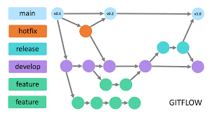

# book-store
Dự án phát triển website bán sách   
- FE: ReactJS  
- BE: Spring Boot
- Lưu trữ: Github
- Thiết kế UI, UX,...: Figma
- Lưu trữ online: Drive
- Cơ sở dữ liệu: MySQl 

# Github flow
- Dự án được triển khai theo flow dưới đây  

# Qui trình công việc
- B1: Thiết kế hoặc xác định cơ bản giao diện
- B2: Xây dựng base của cơ sở dữ liệu
- B3: Xây dựng các kết nối tới server
- B4: Xây dựng FE và kết nối tới server
- B5: Kiểm tra, triển khai bổ sung

***Lưu ý***: Trong quá trình làm liên tục cập nhật doc riêng trên từng branch và 
phải có quy tắc đặt tên chung / quy tắc thiết kế.
